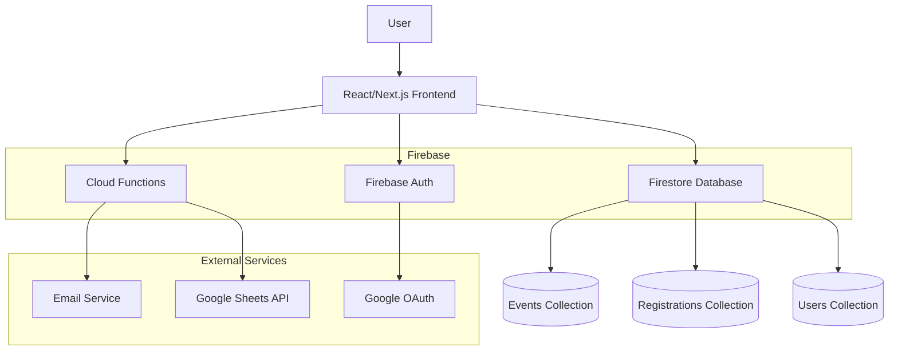

# Architecture Diagram

## High-Level System Architecture

## Data Flow Description

1. **User Authentication Flow**
   - User clicks Google login on frontend
   - Frontend redirects to Firebase Auth with Google provider
   - Firebase Auth handles OAuth flow with Google
   - Upon successful authentication, user session is established

2. **Event Publishing Flow**
   - Admin creates event in frontend admin dashboard
   - Frontend calls Cloud Function to validate and store event
   - Cloud Function writes event data to Firestore Events collection
   - Real-time listeners update frontend with new event data

3. **Event Registration Flow**
   - User browses events on frontend
   - User clicks register button with optional reason
   - Frontend calls Cloud Function to process registration
   - Cloud Function validates registration and writes to Registrations collection
   - Cloud Function triggers email notification to user and admin

4. **Data Export Flow**
   - Admin initiates export from dashboard
   - Frontend calls Cloud Function for export
   - Cloud Function queries Firestore for registration data
   - Cloud Function formats data and sends to Google Sheets API
   - Admin receives confirmation of successful export

## Component Interactions

- **Frontend ↔ Firestore**: Direct read/write operations for real-time data
- **Frontend ↔ Cloud Functions**: API calls for complex operations and external integrations
- **Cloud Functions ↔ Firestore**: Server-side data operations and business logic
- **Cloud Functions ↔ External APIs**: Email sending and Google Sheets integration

## Security Layers

- **Authentication**: Firebase Auth handles user identity verification
- **Authorization**: Firestore Security Rules control data access
- **API Security**: Cloud Functions validate requests and enforce rate limiting
- **Data Encryption**: Firebase encrypts data at rest and in transit